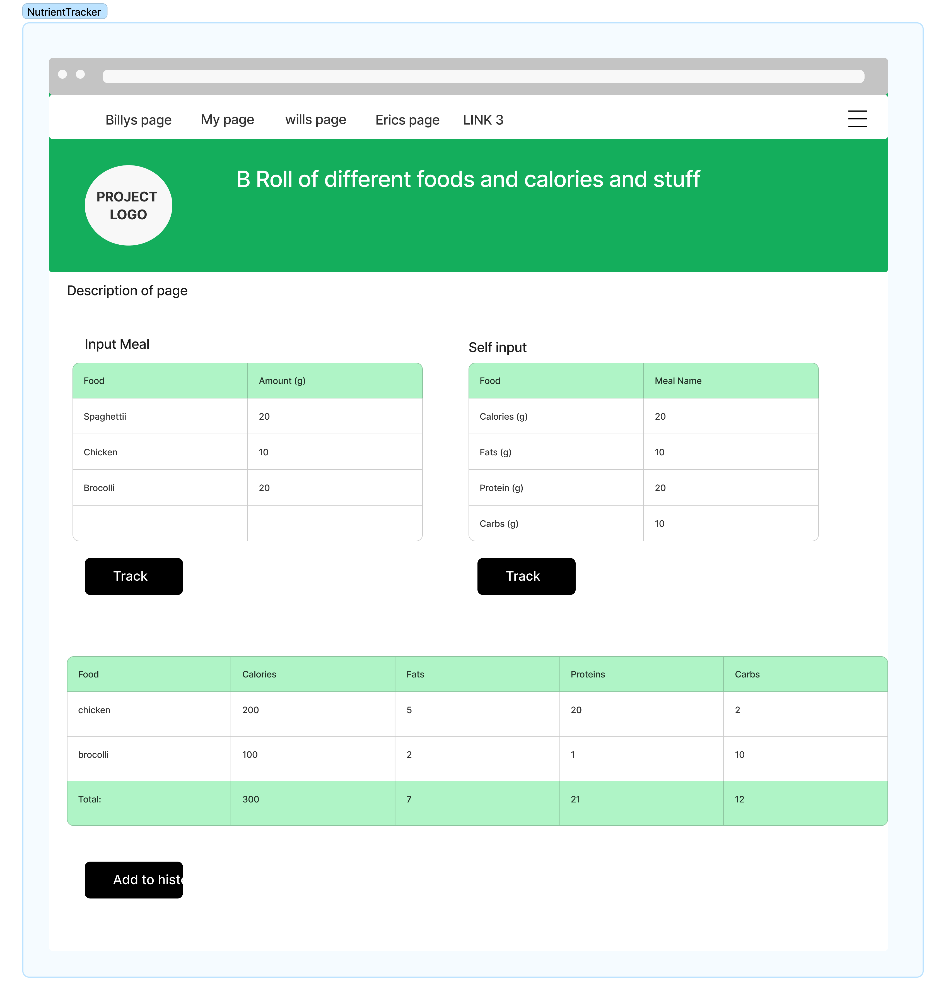
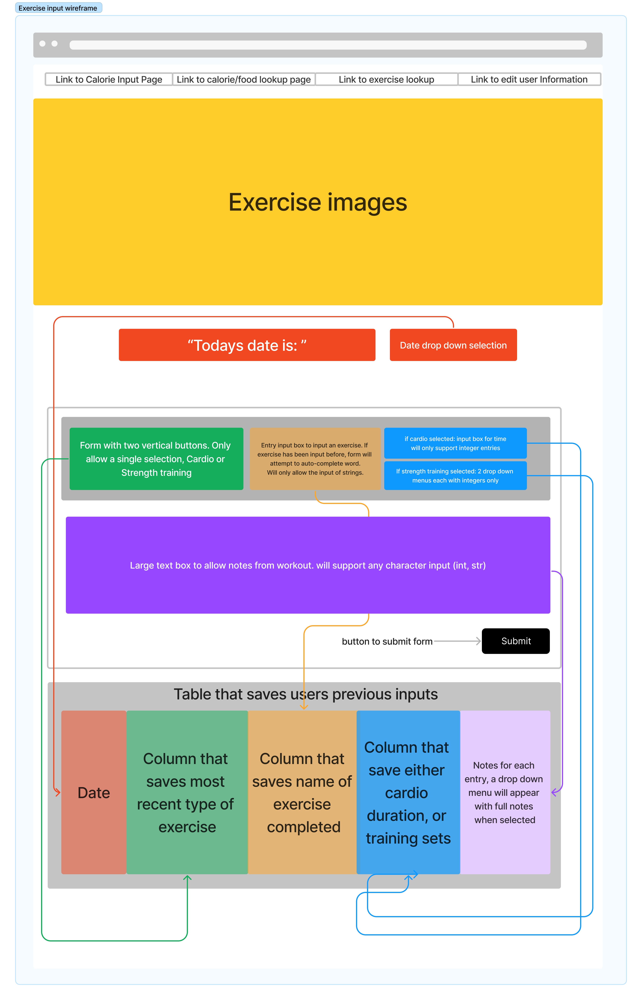

### Billy

#### Page Title: 

Login/Create Account/Forgot Password

#### Page Description: 

These pages will handle user verification or account creation, store that data in a database, and pass information for other pages to use. 

#### Parameters needed for the page: 

These pages will receive a number of parameters to include, First Name, Last Name, Date of Birth, Gender, Username, E-mail.

#### Data needed to render the page: 

No real data will be required to render this page. Instead this page will receive and verify data before passing to an index page.

#### Link destinations for the page: 

This page will connect to each of the Login/Create Account/Forgot Password pages then link directly to the index page.

#### List of tests for verifying the rendering of the page: 

Tests will include data input validation, a test for adding to an existing database, creating a database if one does not exist, and a test for editing a database entry.

### Dylan

#### Page Title: 
Nutrient Tracker (URL: nutrients (?))

#### Page Description: 
This page is going to be where you input the food you’ve eaten and get a breakdown of the calories and macro nutrients within that food. There is the option to either input the different foods within a meal or to input your own meal and add the nutrient info yourself. This second option will allow for different meals since there are an almost infinite amount of them. This can then be added to the database where we track the nutrient values of different foods. The page will also have a table displaying the total nutrient values consumed for the day that will be filled out (with a running total) when you enter food in. That table will also have the option to push the data to your nutrient tracking database which allows you to keep track of your nutrients over time. 

#### Parameters needed for the page: 
The parameters taken in on this page will be string inputs for food, selector buttons to calculate inputs and add calculated results to history database.

#### Data needed to render the page: 
A large function of this page is to track user nutrient history, so it will need to data for user information so that individuals data can be tracked. It will need to have the date (get without input somehow?) so that the tracking follows time. It will also have to have access to food nutrient info database so that amounts of food eaten can be translated to nutrient information on the page. This allows users who just want to see nutrient info of a specific food to input something once and not have to login. 

#### Link destinations for the page: 
This page will link to all other pages via the nav bar at the top and will also link to a page that has a table with the users nutrient and workout history as well as analytics to track nutrient and excersize activity.

#### List of tests for verifying the rendering of the page: 
type validation so that only correct information can be input. 
database access validation to ensure correct information is being recieved and input. 
link validation to ensure that links go to the correct page. 
testing to ensure that user data is stored through time. 
Tests to ensure that user food input to the database is reasonable so that our database isn't being filled with nonsensical entries that waste space. 

### Eric

#### Page Title: Exercise Input

#### Page Description: 

#### Parameters needed for the page: 

The parameters taken in on this page will be inputs for date, selector buttons for cardio or strength training, string input for exercise performed, integer input for cardio duration or integer input for sets/reps performed, and string input for notes per exercise.

#### Data needed to render the page: 

Data needed to render page will be input by user at time of input. secondary goal is to assosiate data with user info so page populates with old exercise data when returning to the page after visting other pages or a log-out and log back in condition. 

#### Link destinations for the page: 

This page will link to all other pages per a navigation bar at top of page. 

#### List of tests for verifying the rendering of the page: 

Tests will include type validation for input boxes to ensure proper information is saved into table. 

### Jordon

#### Page Title: 

Exercise Log Page

#### Page Description: 

The exercise log page is where the history of workouts is stored. For now it includes only information for strength training workouts. The workouts themselves, the exercises, and the sets will collapse and expand to show and hide information.

#### Parameters needed for the page:

The only parameter needed will be user's identifier—not sure what we will use, but an ID would make sense. All associated data can be queried with the user ID.

#### Data needed to render the page: 

The there is a nested structure similar to how the SQL table is laid out. At the top of the page, the user's name might appear. Under that, the list of workouts with expandable sections for exercises / sets. The way the database is structured, the main list will will be a query for workouts. If the user chooses to expand a workout, the exercise groups corresponding to that workout will be fetched. If the user expands an exercise group, the set information will be fetched.

The main reason I've structure it that way is to learn more about handling requests—basically to make it harder on myself. A simpler way to do this would be to paginate the workouts and pull all associated data to start with.

#### Link destinations for the page: 

This is a terminal page, not a path on a funnel. The app / site navigation will be available at the top. 

#### List of tests for verifying the rendering of the page: 

I will need tests for all of SQL queries to see that the database structure exists as intended and that it retrieves the proper data. I'm not sure if we can use Unittest to validate that the retrieved data is successfully populated into HTML, but that is something that is typically done in frontend development. Additional tests like checking show / hide functionality would also be helpful, but I'm unsure if Unittest can manipulate webpages to mock user testing.

In summary, I need to check that the SQL queries pull the correct data and that it ends up on the page in the correct locations.

### Will

#### Page Title: 
Food and Nutrition Lookup

#### Page Description: 
This page is dedicated to assisting users in searching for the nutritional values of various food items. It offers an extensive database where users can look up standard food items. If a user can't find a particular food item, there's a feature to input custom food details, ensuring flexibility and comprehensive tracking.
At the top, there's a prominent search bar where users can type in food items.
As users type, a dropdown list appears, auto-populating with relevant food items from the database.
Each listed item, when clicked, expands to show its detailed nutritional values.
Below the search results, there's an option labeled "Can't find your food? Add custom food details." Clicking on this opens a form where users can manually enter nutritional information for a custom food item.
At the bottom, there are hyperlinks directing users to other sections of the application: login page, nutrition input/tracker, exercise input, and exercise lookup.
The page should look something like this: 

#### Parameters needed for the page:
Food item name or keyword for searching.
Custom food details: Name, serving size, macronutrients (proteins, fats, carbs), and any other relevant nutritional information.

#### Data needed to render the page: 
Database of food items with their complete nutritional information.
User's custom food entries.

#### Link destinations for the page: 
Login Page: For users to sign in or register to the platform.
Nutrition Input/Tracker: Where users can input and monitor the nutritional values of foods they've consumed.
Exercise Input Page: Allows users to add details of their physical activities.
Exercise Lookup Page: Users can search for different exercises and their caloric burns.

#### List of tests for verifying the rendering of the page: 

1. Search Functionality:

-Test Basic Search: Ensure users can type into the search bar and that results appear based on input.
-Test Dropdown List: Check if the dropdown list auto-populates with relevant food items from the database as the user types.
-Test Search Results: Verify that clicking on a listed item expands it to show detailed nutritional values.

2. Custom Food Input:

-Test Access to Custom Input Form: Ensure the "Can't find your food? Add custom food details" option is accessible and opens the correct form.
-Test Input Fields: Check if users can input details into the form fields without issues.
-Test Data Validation: Ensure that validation checks are in place to prevent incorrect data types (e.g., text in calorie fields) or missing mandatory fields.
-Test Custom Food Submission: Confirm that after submitting a custom food, the data is saved correctly to the user's profile or the database.

3. Display of Nutritional Information:

-Test Information Display: Check that the expanded food item displays all nutritional values correctly.
-Test Custom Food Display: Verify that custom foods added by the user show up in search results and display the correct information when clicked.

4. Linking to Other Pages:

-Test Login Page Link: Ensure that the link to the login page redirects users to the correct login page.
-Test Nutrition Input/Tracker Link: Confirm that the link directs users to the correct page where they can input and monitor their nutrition.
-Test Exercise Input Page Link: Ensure that users are redirected to the correct exercise input page.
-Test Exercise Lookup Page Link: Confirm that users are taken to the correct exercise lookup page when they click the link.

5. Responsiveness and Compatibility (may not be necessary except for whichever compatible format we choose to implement)

-Test Mobile Responsiveness: Check the page on various mobile devices to ensure elements adjust and display correctly.
-Test Tablet Responsiveness: Confirm the page adjusts well to tablet screen sizes.
-Test Browser Compatibility: Ensure the page renders correctly across different browsers like Chrome, Firefox, Safari, and Edge.

6. Accessibility Tests:

-Test Color Contrast: Ensure text is readable, and there's sufficient contrast between text and background colors.
-Test Keyboard Navigation: Verify that users can navigate the page using only the keyboard.
-Test Screen Reader Compatibility: Check the page's compatibility with screen readers and that all elements are appropriately labeled.

7. Performance Tests:

-Test Load Time: Ensure the page loads within a reasonable time frame.
-Test Image Loading: Check that images (if any) load correctly and do not delay the overall page loading.
-Test Server Response: Ensure the server responds quickly when fetching data from the database.

8. Error Handling:

-Test Invalid Search: Input gibberish or unrelated text in the search bar and confirm that the page handles it gracefully, possibly with a "No results found" message.
-Test Form Errors: Intentionally leave out mandatory fields in the custom food form to see if appropriate error messages appear.
